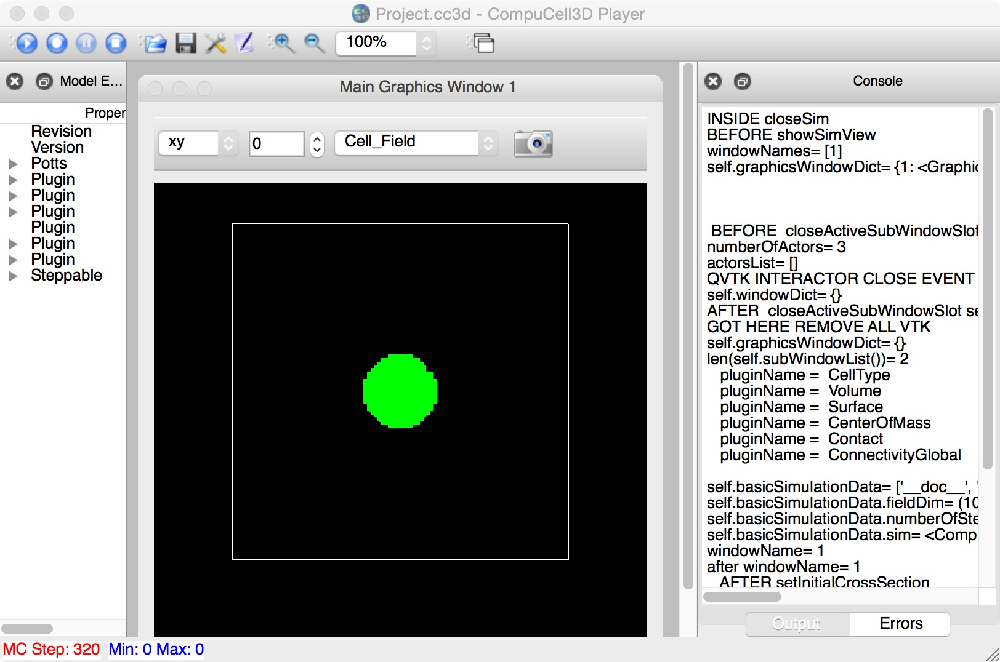

# Circulizer-Demo

A demonstration of CC3D plugin development, resulting in a custom cell-behavior shown above. The process described in detail on my Bioinformatics Website:

* [Part 1](https://cc3dadvancedtuts.wordpress.com/2015/09/27/making-a-compucell-energy-term-plugin-in-c-with-a-python-wrap/)
* [Part 2](https://cc3dadvancedtuts.wordpress.com/2015/09/27/making-a-compucell-plugin-with-a-python-wrapper-part-2/)
* [Part 3](https://cc3dadvancedtuts.wordpress.com/2015/12/22/making-a-compucell-plugin-with-a-python-wrapper-part-3/)